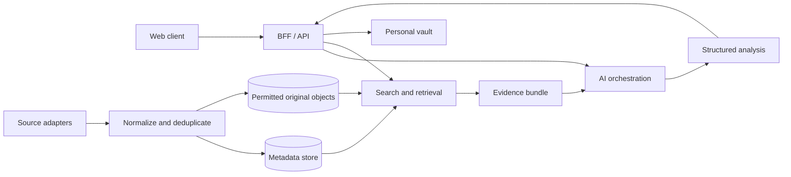

# 기술 아키텍처 초안

작성일: 2026-08-21

이 문서는 공급자 중립적인 논리 구조다. 프론트엔드 프로토타입은 React 19, Vite 6, MapLibre GL JS로 구성한다. 백엔드는 Cloudflare-first로 선택해 Worker BFF와 D1의 로컬 기반을 구현했으며, 실제 외부 리소스 생성 전에는 사용자 승인을 받는다. 구체 계획과 구현 경계는 [backend-cloudflare-plan.md](./backend-cloudflare-plan.md)에 기록한다.

## 1. 전체 흐름

### 경계

- 웹 클라이언트는 외부 API 키를 직접 소유하지 않는다.
- BFF/API가 인증, 권한, 요청 제한과 사용자별 데이터를 관리한다.
- 소스 어댑터는 공급자별 응답을 공통 구조로 바꾸되 원본 식별자를 보존한다.
- 검색 계층은 AI에게 보내기 전에 출처와 인용 가능한 위치를 묶는다.
- AI 결과는 원문과 별도 레코드로 저장하며 생성 시각과 사용 모델을 기록한다.

## 2. 데이터 수집 파이프라인

1. 예약 수집 또는 사용자의 명시적 검색 요청
2. 공급자별 응답과 요청 메타데이터 보존
3. 시간·기관·식별자 기준 중복 제거
4. 공통 필드 및 분야별 필드 정규화
5. 이용 권한에 따라 원문, 일부 발췌, 메타데이터·링크 중 하나만 저장
6. 검색 인덱스 갱신
7. 중요도 변화가 임계치를 넘으면 브리핑 후보 생성
8. 여러 출처를 모은 뒤 AI 요약·분석 생성

수집 실패와 ‘새 사건 없음’을 구분하고, 이전 데이터가 최신인 것처럼 보이지 않게 마지막 성공 시각을 노출한다.

## 3. 내장 캡처 경로

### 사이트 내부

1. 사용자가 `AI 분석`을 연다.
2. `영역 선택`을 누른다.
3. 앱 내부의 카드, 지도, 그래프 또는 텍스트 범위를 선택한다.
4. 이미지뿐 아니라 가능한 경우 원본 레코드 ID와 선택된 텍스트를 함께 보낸다.

### 다른 탭·창·화면

1. 사용자가 `탭/창/화면 공유`를 누른다.
2. 브라우저의 `getDisplayMedia` 선택 창에서 대상을 직접 허용한다.
3. 미리보기에서 분석할 영역을 자른다.
4. 전송 전 이미지와 포함될 정보를 확인한다.
5. 서버에는 사용자가 확정한 캡처만 업로드한다.

공유 권한은 브라우저 보안 모델상 사용자 동작마다 다시 요청할 수 있다. 이 제약을 우회하지 않는다.

## 4. AI 분석 계약

AI 응답은 자유형 Markdown 한 덩어리가 아니라 다음 구조를 기본으로 한다.

- 분석 대상과 기준 시각
- 3~5줄 핵심 요약
- 확인된 사실 목록과 각 근거
- 주장·추론·불확실 항목
- 행위자 또는 핵심 개념
- 시간순 변화 또는 유도 단계
- 인과관계와 대안 설명
- 영향 또는 물리적 의미
- 시나리오와 성립 조건
- 더 확인할 원자료
- 사용자 수준에 맞춘 보충 설명

국제정세 분석에서는 예측을 사실처럼 표시하지 않는다. 물리 분석에서는 차원, 부호, 가정, 근사 범위와 원식의 출처를 검토 항목으로 둔다.

## 5. 수준 적응

사실과 근거는 모든 수준에서 동일하게 유지하고, 표현만 바꾼다.

- 용어를 바로 쓰는지 먼저 설명하는지
- 수식 유도의 생략 단계
- 필요한 선수 개념 링크
- 원문을 먼저 보여줄지 해설을 먼저 보여줄지
- 연습 질문과 반례의 난도

사용자는 AI가 자동 추정한 수준을 언제든 직접 수정할 수 있어야 한다. 분야 하나의 수준이 다른 분야에 자동 적용되지 않는다.

## 6. 개인 자료 보관소

- 메타데이터와 파일 객체를 분리한다.
- 외부 링크는 마지막 확인 시각과 깨진 링크 상태를 기록한다.
- PDF·이미지 분석 결과는 페이지 또는 영역 좌표를 원문 인용으로 보존한다.
- 사용자 노트, AI 생성물, 원본을 서로 덮어쓰지 않는다.
- 삭제 요청은 검색 인덱스, 파생 청크, AI 기록과 원본 파일에 전파되어야 한다.

## 7. 다중 사용자 대비

첫 버전은 개인용이지만 모든 개인 데이터에는 소유자 경계를 둔다.

- 사용자별 자료·분석·설정 분리
- 공개 데이터 캐시와 개인 자료 저장소 분리
- 서버에서 접근 권한 검사
- 공유 기능은 나중에 명시적으로 추가하며 기본값은 비공개

## 8. 현재 선택과 아직 선택하지 않는 기술

- 프론트엔드 프로토타입: React 19, Vite 6, MapLibre GL JS, OpenFreeMap, Phosphor Icons
- 지도 운영 추천: Protomaps PMTiles + Cloudflare R2/Worker 캐시
- 현재 로컬 백엔드: Workers Static Assets + Worker BFF + D1, `/api/v1` client
- 구현된 데이터 경계: 공개 데모 사건 읽기, Access 기반 개인 신원, owner-scoped 노트와 수준 설정
- 운영 확장 추천: R2 + Queues + Workflows
- 후속 추천: Workflows, Vectorize, AI Gateway
- 아직 미확정: 실제 Cloudflare 리소스, production Access 정책, 인증 공개 범위, AI 모델, 첫 실제 수집 API, 비용 상한

선택 기준은 시각적 선호가 아니라 실제 데이터 수집, 캡처 업로드, 저장, 검색, 인용 검증을 가장 작은 비용으로 끝까지 실행할 수 있는지다. Firebase는 공개 회원가입·소셜 로그인·모바일 오프라인 동기화가 첫 출시의 핵심이 될 때 다시 비교한다.
